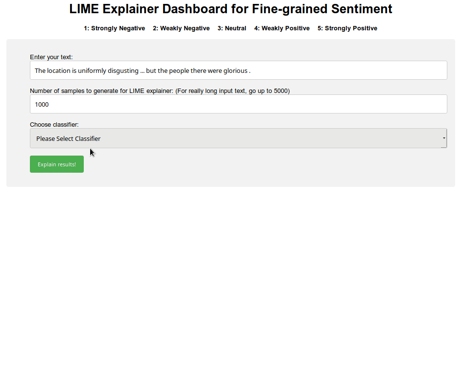

# An Explainer App for Fine Grained Sentiment Classification

This repo contains an initial prototype of an interactive application written in Flask, that explains the results of fine-grained sentiment classification.

A number of classifiers are implemented and their results explained using the [LIME explainer](https://arxiv.org/pdf/1602.04938.pdf). 
The classifers were trained on the  [Stanford Sentiment Treebank](https://nlp.stanford.edu/sentiment/) (SST-5) dataset. The class labels are any of `[1, 2, 3, 4, 5]`, where `1` is very negative and `5` is very positive. 


## Installation

First, set up virtual environment and install from ```requirements.txt```:

    python3 -m venv venv
    source venv/bin/activate
    pip3 install -r requirements.txt

For further development, simply activate the existing virtual environment.

    source venv/bin/activate


## Usage

Run the file `app.py` and then enter a sentence, choose a type of classifier and click on the button `Explain results!`. We can then observe the features (i.e. words or tokens) that contributed to the classifier predicting a particular class label. 

## Demo for the front-end
The front-end app takes in a text sample and outputs LIME explanations for the different methods.

Play with your own text examples as shown below and see the fine-grained sentiment results explained!

**NOTE:** Because the PyTorch-based models (Flair and the causal transformer) are quite expensive to run inference with (they require a GPU), these methods are not deployed.



